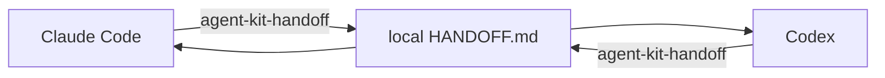

# agent-project-kit


Claude Code와 Codex가 같은 프로젝트에서 교대 작업할 수 있게 만드는 **프로젝트 로컬 하네스**다.
신규 프로젝트의 초기 setup과 진행 중인 프로젝트의 무손상 편입을 지원한다.

| 하고 싶은 것 | 방법 |
|---|---|
| 신규 프로젝트에 하네스 설치 | `./bootstrap.sh <경로>` → 에이전트에서 `agent-kit-init` |
| 진행 중 프로젝트에 편입 | `./bootstrap.sh --adopt <경로>` → 에이전트에서 `agent-kit-adopt` |
| `AGENTS.md`/`CLAUDE.md` 생성·병합 | init/adopt 스킬이 인터뷰·승인 하에 수행 |
| 도구 전환·세션 인수인계 | `agent-kit-handoff` → 다음 도구가 HANDOFF 자동 복원 |
| 사용자 스킬을 두 도구에 배포 | `agent-kit-skill-sync` |
| PR 리뷰 자동 처리 | `review-killer` Agent — "PR #N 리뷰 처리해줘" |
| Jira 티켓 자동 개발 | `developer` Agent — "작업 시작하자" |
| 상태 진단 / 제거 | `--doctor` / `--uninstall` |

설치된 규칙·스킬·handoff·훅은 대상 프로젝트에서만 작동하며, 정상적인
`git add -A → commit → push` 흐름의 commit tree에는 들어가지 않는다. installer는 대상의
기존 `AGENTS.md`, `CLAUDE.md`, `.gitignore`, 소스와 provider tool config를 덮어쓰지 않는다.
Git의 추적 밖 local/worktree config에는 guard 활성화를 위한 명시적 managed block만 추가한다.

공유 지침 문서는 설치 후 첫 에이전트 세션이 만든다: `agent-kit-init`이 사용자 인터뷰로
프로젝트 큰 그림을 담은 `AGENTS.md`(canonical)와 이를 가리키는 포인터 `CLAUDE.md`를 승인
하에 생성하고, `agent-kit-adopt`는 기존 두 파일의 규칙을 승인 하에 `AGENTS.md` 기준으로
병합 개편한다. 이 두 파일은 사용자 소유 tracked 문서로 commit/push가 허용된다.

> 자세한 순서: [GETTING-STARTED.md](GETTING-STARTED.md)
>
> 설계와 보안 경계: [docs/architecture.md](docs/architecture.md)
>
> 수동 수용 테스트: [docs/acceptance-test.md](docs/acceptance-test.md)
>
> 조사와 출처 판정: [docs/research/harness-engineering.md](docs/research/harness-engineering.md)

## 왜 필요한가

코딩 에이전트의 품질은 모델 하나만으로 결정되지 않는다. 다음 세션이 목표와 실패를 복원할 수
있는 상태, 짧고 정확한 프로젝트 규칙, 실제 실행 가능한 검증, 위험 작업과 커밋을 막는 피드백
루프가 함께 있어야 한다.

이 킷은 다음 문제를 다룬다.

- Claude Code 세션 한도가 끝난 뒤 Codex가 같은 작업을 이어간다.
- Codex로 탐색·구현하다가 Claude Code로 리뷰나 후속 작업을 넘긴다.
- 새 프로젝트가 첫 작업부터 근거·검증·보안 규칙 위에서 시작한다.
- 진행 중인 프로젝트의 기존 지침과 Git 상태를 망가뜨리지 않고 하네스를 덧붙인다.
- 반복 지시와 전체 저장소 재탐색을 줄여 토큰·세션 시간을 아낀다.
- 킷 파일이 사용자의 기능 커밋에 섞이는 실수를 여러 층에서 방지한다.

## 핵심 보장

설치 성공 시 다음 불변식을 검사한다.

1. 설치 전후 대상 프로젝트의 사용자 Git status가 같다.
2. 기존 tracked 파일의 내용은 바뀌지 않는다.
3. 킷 소유 worktree 파일은 `$GIT_COMMON_DIR/info/exclude`의 정확한 경로로 숨긴다.
4. 일반 `git add -A`에는 킷 소유 경로가 0개다.
5. force-add된 킷 파일은 pre-commit이, 우회해 만든 outgoing commit은 pre-push가 차단한다.
6. 설치 manifest와 hash로 doctor·재설치·제거의 소유권을 판단한다.
7. Claude Code와 Codex에는 동일 원본에서 생성한 스킬이 설치된다.

Git ignore와 client hook은 권한을 가진 사용자가 `git add -f`, `--no-verify`, hook 설정 변경을
고의로 함께 사용하면 우회할 수 있다. 중앙 강제가 필요하면 원격 CI/branch protection도
운영해야 한다. 이 킷은 그러한 한계를 숨기고 “절대 불가능”하다고 주장하지 않는다.

## 요구 사항

- Git 2.31+ worktree — 일반 clone/linked worktree 지원(2.42+에서는 NUL 목록 사용)
- Python 3.10+ — 표준 라이브러리만 사용
- Bash와 POSIX file lock을 제공하는 macOS/Linux
- 사용할 에이전트: Claude Code, Codex 또는 둘 다

대상은 먼저 Git 저장소여야 한다. 글로벌 `~/.claude`, `~/.codex`, `~/.agents`는 수정하지
않는다.

## 빠른 시작

### 신규 프로젝트

```bash
mkdir my-project
git -C my-project init

/path/to/agent-project-kit/bootstrap.sh /path/to/my-project
```

프로젝트에서 Claude Code 또는 Codex를 열고 다음처럼 요청한다.

```text
agent-kit-init 스킬로 프로젝트 인터뷰를 진행해서 AGENTS.md와 포인터 CLAUDE.md를 만들고,
로컬 컨텍스트와 첫 handoff를 완성해 줘.
```

에이전트가 프로젝트의 목적·스택·성공 기준·사용할 Agent 도구를 인터뷰한 뒤, 승인을 받아
`AGENTS.md`/`CLAUDE.md`를 생성한다. 이 두 파일과 프로젝트 소스는 평소처럼 commit한다.
킷 setup 자체(로컬 하네스 파일)는 commit하지 않는다.

### 진행 중인 프로젝트 편입

```bash
/path/to/agent-project-kit/bootstrap.sh --adopt /path/to/existing-project
```

그 프로젝트의 Claude Code 또는 Codex 세션에서 다음처럼 요청한다.

```text
agent-kit-adopt 스킬로 현재 규칙, Git 상태, 실행·검증 방법을 로컬 하네스에 편입하고,
기존 AGENTS.md/CLAUDE.md가 있으면 AGENTS.md 기준 canonical+포인터 구조로 병합 개편안을 제시해 줘.
```

편입은 기존 dirty/staged/untracked 사용자 상태를 보존한다. owned adapter 경로에 기존 파일이나
symlink가 있으면 덮어쓰지 않고 설치 전에 실패한다.

## 사용 설명서 — 상황별 요청 문구

설치 후에는 명령어가 아니라 에이전트에게 말하는 방식으로 하네스를 쓴다. 대표 문구:

| 상황 | 에이전트에게 이렇게 요청 |
|---|---|
| 신규 프로젝트 첫 세션 | "agent-kit-init 스킬로 프로젝트 인터뷰 진행해서 AGENTS.md와 포인터 CLAUDE.md 만들어 줘" |
| 기존 프로젝트 편입 | "agent-kit-adopt 스킬로 편입하고, 기존 규칙은 AGENTS.md 기준 병합 개편안을 diff로 제시해 줘" |
| 도구 바꾸기 전 | "agent-kit-handoff 스킬로 지금 상태 정리해 줘" |
| 세션/마일스톤 마무리 | "agent-kit-wrap-up 스킬로 마무리해 줘" |
| 스킬 만들기·수정·삭제 | "~하는 스킬 만들어 줘" (skill-sync 절차로 두 도구에 동일 반영) |
| PR 리뷰 자동 처리 | "review-killer agent로 PR #111 리뷰 처리해 줘" |
| 타임아웃 후 재개 | "리뷰 자동 처리 계속 진행해 줘" |
| Jira 티켓 개발 | "developer agent로 작업 시작하자" (보드/담당자 미지정 시 CONTEXT 기억값 사용) |
| 이어받은 세션 시작 | "HANDOFF 확인하고 이어서 해 줘" (Claude Code는 자동 로드, 명시하면 더 확실) |

Agent는 트리거 문구로만 가동되고, 모호하면 반드시 질문하며 답을 받을 때까지 대기한다.
developer Agent의 commit/PR은 초안 승인 게이트를 거친다. 상세 계약은 설치된
`.agent-project-kit/AGENT-RULES.md` 참조.

## Claude Code ↔ Codex 전환

현재 도구에서:

```text
agent-kit-handoff 스킬로 지금 상태를 다음 도구에 넘길 수 있게 정리해 줘.
```

이 스킬은 공통 `.agent-project-kit/HANDOFF.md`에 다음을 기록한다.

- 현재 목표와 acceptance criteria
- branch, HEAD, staged/unstaged/untracked 상태
- 완료한 작업과 결정 근거
- 실행한 검증 명령과 PASS/FAIL/UNRUN
- 실패·미확인·주의사항
- 다음 우선 작업 1~3개와 첫 행동

그다음 같은 프로젝트에서 다른 도구를 연다. 다음 도구는 같은 handoff를 읽고 Git 상태를 작은
명령으로 재확인한 뒤 계속한다. 전체 저장소를 매번 처음부터 다시 설명할 필요가 없다.



## CLI

| 명령 | 변경 여부 | 용도 |
|---|---:|---|
| `bootstrap.sh <target>` | 쓰기 | 신규 프로젝트에 로컬 하네스 설치 또는 안전한 재설치 |
| `bootstrap.sh --adopt <target>` | 쓰기 | 진행 중인 프로젝트에 편입 모드로 설치 |
| `bootstrap.sh --diff <target>` | 읽기 전용 | manifest와 실제 adapter/hash/exclude/hook 차이 확인 |
| `bootstrap.sh --doctor <target>` | 읽기 전용 | 격리, 추적 상태, 훅, 도구 parity, 손상을 종합 진단 |
| `bootstrap.sh --uninstall <target>` | 쓰기 | 전체 preflight가 깨끗할 때만 원자적으로 제거·복원 |

예시:

```bash
./bootstrap.sh --doctor ../my-project
./bootstrap.sh --diff ../my-project
./bootstrap.sh --uninstall ../my-project
```

재설치는 멱등이다. `CONTEXT.md`와 `HANDOFF.md`는 의도적인 mutable state라 내용 변경을
보존한다. 그 밖의 owned 파일을 사용자가 수정했다면 자동 덮어쓰기나 자동 삭제를 하지 않고
충돌로 보고한다.

## 대상 프로젝트에 생기는 것

### worktree — 도구가 발견해야 하는 local-only 파일

| 경로 | 역할 |
|---|---|
| `.agent-project-kit/CONTEXT.md` | 짧은 공통 규칙과 컨텍스트 로딩 순서 |
| `.agent-project-kit/HANDOFF.md` | Claude/Codex가 공유하는 활성 작업 상태 |
| `.agent-project-kit/hooks/guard.py` | 두 도구가 호출하는 공통 안전 검사 |
| `.agent-project-kit/templates/*.template.md` | init/adopt가 쓰는 `AGENTS.md`·`CLAUDE.md` 템플릿 |
| `.agent-project-kit/AGENT-RULES.md` | 커스텀 Agent 공통 계약 (가동 절차·질문 원칙·Git/QA 규칙·lock) |
| `.claude/agents/<name>.md` | Claude Code용 커스텀 Agent 정의 (developer, review-killer) |
| `.codex/agents/<name>.toml` | Codex용 커스텀 Agent 정의 — 같은 AGENT.md payload에서 설치 시 생성 |
| `AGENTS.override.md` | Codex가 공통 컨텍스트와 기존 `AGENTS.md`를 읽게 하는 얇은 어댑터 |
| `CLAUDE.local.md` | Claude Code가 공통 컨텍스트를 읽게 하는 얇은 어댑터 |
| `.agents/skills/agent-kit-*/SKILL.md` | Codex용 공식 project skill 경로 |
| `.claude/skills/agent-kit-*/SKILL.md` | Claude Code용 공식 project skill 경로 |
| `.codex/hooks.json` | Codex 프로젝트 훅 연결 |
| `.claude/settings.local.json` | Claude Code 프로젝트 로컬 훅 연결 |

각 파일은 개별 exact path로 local exclude한다. 디렉터리 전체를 blanket-ignore하지 않는다.

`AGENTS.override.md`는 Codex에서 같은 디렉터리의 `AGENTS.md`보다 우선하므로, 어댑터가 기존
`AGENTS.md`가 있으면 먼저 명시적으로 읽고 준수하도록 지시한다. 원본 파일은 수정하지 않는다.

### Git common dir — worktree 밖의 설치 원장

```text
$GIT_COMMON_DIR/agent-project-kit/
  manifest.json
  guard.py
  dispatcher.py
  hooks/pre-commit
  hooks/pre-push
$GIT_COMMON_DIR/agent-project-kit.lock
```

여기에는 owned path/hash, 설치 모드, `info/exclude` 원본 bytes·mode, local/worktree hook 설정과
선택된 Git config의 원본 prefix/hash·mode 복원 정보가 들어간다. sibling lock 파일은
설치·재설치·제거가 동시에 원장을 바꾸지 못하게
직렬화하며 제거 뒤에도 재사용한다. linked worktree의 `.git`이 파일이어도
`git rev-parse --git-common-dir` 결과를 사용한다.

현재는 하나의 Git common dir에 활성 킷 설치를 하나만 둔다. linked worktree 자체를 대상으로
설치할 수는 있지만, 같은 저장소의 두 worktree에 동시에 설치하려면 먼저 기존 worktree에서
`--uninstall`해야 한다. 공통 hook 원장과 어느 worktree의 local adapter를 제거할지 모호해지는
것을 피하기 위한 명시적 제약이다. `info/exclude`는 모든 linked worktree에 공통 적용되므로
설치·진단·제거 때 live sibling worktree의 exact/reserved 경로와 status도 검사한다. 접근할 수
없는 worktree나 숨겨질 사용자 파일이 하나라도 있으면 변경 전에 중단한다.

bare 저장소에 linked worktree가 붙은 구성에서는 공통 local-scope `core.hooksPath`가 서버 훅까지
바꿀 수 있으므로 local-scope 설치를 거부한다. 이 경우 `extensions.worktreeConfig=true`로
worktree scope를 명시한 뒤 linked worktree에 설치할 수 있다. 설치 도중 worktree/bare 목록이
바뀌어도 성공으로 간주하지 않고 전체 rollback한다.

## 포함된 스킬

| 스킬 | 언제 쓰나 | 하는 일 |
|---|---|---|
| `agent-kit-init` | 신규 프로젝트 첫 세션 | 사용자 인터뷰로 `AGENTS.md`+포인터 `CLAUDE.md`를 승인 하에 생성하고 `CONTEXT/HANDOFF`를 채움 |
| `agent-kit-adopt` | 진행 중 프로젝트 편입 | 기존 지침을 보존·요약하고, 승인 하에 `AGENTS.md` 기준 canonical+포인터 구조로 병합 개편 |
| `agent-kit-handoff` | 도구/세션 교대 직전 | Git·검증·실패·다음 행동을 공통 handoff에 기록 |
| `agent-kit-wrap-up` | 세션/마일스톤 종료 | 완료 이력을 압축하고 검증·미완료 작업·다음 행동을 현행화 |
| `agent-kit-skill-sync` | 사용자 스킬 생성·수정·삭제 | 선언된 모든 Agent 도구 경로에 동일 원본으로 반영하고 동작 검증 후 산출물 정리 |

두 provider 디렉터리의 스킬은 같은 payload에서 복사되고 테스트로 parity를 확인한다. 기본
이름을 `agent-kit-*`으로 namespace해 글로벌/bundled skill과 충돌하지 않게 한다.

## 포함된 커스텀 Agent

| Agent | 트리거 예시 | 하는 일 |
|---|---|---|
| `review-killer` | "PR #111 리뷰 처리해줘" | PR 리뷰 모니터링(30초×40~60회)·blocker 동시 감시·Blocker/Major 처리(수정/반박/보류)·상태 기반 종료("머지 가능합니다" 통보, merge는 하지 않음) |
| `developer` | "작업 시작하자", "Agent와 개발 진행할래" | Jira 보드에서 담당 티켓 선정·잠금 코멘트·구현·테스트/QA 후 **승인 게이트를 거쳐** commit/PR·티켓 이동 |

- 본문은 `payload/agents/<name>/AGENT.md` 한 벌이며, Claude Code에는 `.claude/agents/<name>.md`
  (model: opus), Codex에는 `.codex/agents/<name>.toml`(model: gpt-5.6-sol, reasoning high)로
  설치 시 렌더링된다. doctor가 payload 대비 drift를 hash로 검사한다.
- 공통 계약은 `.agent-project-kit/AGENT-RULES.md`에 있다: 트리거 문구로만 가동(자동 가동 없음),
  모호하면 질문하고 답을 받을 때까지 대기, 명시된 작업 범위만 수정, soln-va-tools 스킬 우선,
  한 커밋 = 하나의 변경 이유 + 코드 + 테스트, force-push 절대 금지, 자체 merge 금지(통보만),
  브랜치·커밋·PR 제목에 Jira 번호 금지(링크는 description에만), 상위 모델 필요 시 재가동 요청,
  공유 문서 갱신 시 `<파일>.lock` 규약.
- 두 Agent 모두 명시 호출 방식이다. 세션 자동 가동은 실측 검증 후 승격을 검토한다.

“local이 global을 항상 override한다”는 이식 가능한 규칙은 없다. Claude Code는 같은 이름에서
enterprise → personal → project 순이며 이 세 범위의 스킬은 bundled skill을 대체한다. Codex는
같은 `name`의 스킬을 병합하거나 하나로 덮지 않고 둘 다 selector에 표시한다. 따라서 이 킷은
글로벌 스킬을 수정하지 않으며, 꼭 대체해야 할 때는 각 도구의 공식 우선순위/disable 설정을
별도로 확인하고 project-local의 고유 이름을 명시 호출한다.

## 규칙과 훅

### 공통 규칙

- 사실·출처·추론·미확인을 구분한다.
- 실행하지 않은 테스트를 통과했다고 쓰지 않는다.
- 다음 세션이 재현할 수 있는 명령과 결과를 남긴다.
- 전체 로그 대신 실패 원인과 검증 anchor를 남긴다.
- 작업 중 프로젝트 문서를 수정하는 것은 사용자 기능 변경이며 setup과 구분한다.
- 민감정보를 대화, 명령 인자, URL, Git config 또는 추적 파일에 넣지 않는다.
- 모든 행위에 근거와 검증 과정을 붙인다. 보고서에는 실행 명령·구체 수치·출처를 기재한다.
- 규칙은 `AGENTS.md`에만 기술하고 `CLAUDE.md`는 포인터로 유지한다.
- 사용자 스킬은 선언된 Agent 도구 목록(기본: Claude Code, Codex — 그 외는 사용자에게 확인)
  전체에 생성·수정·삭제를 동기화한다.

### 도구 훅

공통 guard는 Claude Code와 Codex의 공식 프로젝트 훅에서 호출된다.

- 파괴적 shell 명령: recursive force delete, pipe-to-shell, force push, 과도한 chmod,
  명백한 DB destructive command를 보수적으로 차단한다.
- commit 시도: staged path와 내용에서 owned artifact와 대표 secret 패턴을 검사한다.
- Stop 시점: 남아 있는 staged owned artifact와 대표 secret 패턴을 다시 검사한다.

세션 시작의 공통 context/handoff 로딩은 hook이 아니라 `CLAUDE.local.md`와
`AGENTS.override.md` 어댑터가 담당한다.

Codex는 프로젝트 trust와 hook hash 승인이 필요할 수 있고, 조직 managed policy가 Claude 훅을
제한할 수 있다. doctor는 이를 완전히 대신할 수 없으므로 최초 실행 때 각 도구의 승인 UI도
확인한다.

### Git 훅

Git guard는 에이전트 제품 훅과 독립적으로 pre-commit/pre-push에서 동작한다. 선택된
local/worktree Git config 끝에 managed `core.hooksPath` block을 원자적으로 추가하며, 쓰기·제거는
Git과 같은 `<config>.lock`을 사용한다. dispatcher는 실행 시점의 branch/`includeIf` 문맥에서
managed 값 바로 앞의 실제 hook 경로를 찾아 원래 인자·stdin으로 먼저 실행한 뒤 킷 guard를
실행한다. 따라서 설치 뒤 branch가 바뀌어도 그 branch의 기존 hook을 chain한다.

doctor·재설치·제거는 managed config bytes와 effective dispatcher를 확인한다. 선택된 Git config
파일 자체가 설치 뒤 바뀌면 사용자 변경을 덮어쓰지 않고 중단한다. 깨끗한 제거는 config의 원래
bytes·mode 또는 비존재 상태를 정확히 복원한다. 외부 include가 branch에 따라 다른 hook을
제공하는 경우에는 현재 branch의 의미가 자연스럽게 다시 드러난다.

## 기존 프로젝트와 충돌할 때

다음 경로가 이미 tracked 또는 unowned 상태면 설치기는 자동 병합하지 않는다.

- `AGENTS.override.md`, `CLAUDE.local.md`
- `.claude/settings.local.json`, `.codex/hooks.json`
- 설치할 `agent-kit-*` skill 경로
- `.agent-project-kit/**`
- symlink인 parent 또는 leaf path

충돌 파일의 용도를 먼저 확인하고 사용자가 명시적으로 정리하거나 통합한 뒤 다시 설치한다.
기존 `AGENTS.md`, `CLAUDE.md`, `.gitignore`, `.claude/settings.json`, `.codex/config.toml`은
설치 소유 경로가 아니며 그대로 둔다.

소유권 allowlist는 파일에만 적용된다. 설치 전부터 존재했을 수 있는 `.claude`, `.agents`,
`.codex`, `.agent-project-kit` 같은 부모 디렉터리와 그 mode/ACL을 추측해 삭제하지 않는다.
rollback이나 uninstall 뒤 owned 파일은 사라지지만 비어 있는 디렉터리는 남을 수 있다.

## 토큰·세션·모델 효율

- root context는 짧은 지도와 최신 handoff만 제공한다.
- 긴 절차는 해당 skill을 호출할 때만 로드한다.
- 완료 내역은 짧게 압축하고 활성 TODO와 다음 행동을 작게 유지한다.
- 다음 세션은 handoff의 핵심 Git·검증 사실만 재확인한다.
- 독립 탐색은 병렬화하고 같은 질문의 중복 조사는 피한다.
- 명확한 기계 작업에는 저비용 모델, 복합 설계·디버깅에는 강한 모델을 선택한다.
- 측정된 실패 없이 planner/evaluator 계층을 늘리지 않는다.

## 이 저장소 개발

```bash
PYTHONDONTWRITEBYTECODE=1 python3 -m unittest discover -s tests -v
./tests/run.sh
```

주요 acceptance test는 다음이다.

> 임의의 기존 저장소에 설치한 뒤 사용자 소스 하나만 수정하고 일반 add/commit했을 때,
> 생성 commit tree의 킷 소유 경로는 0개이고 기존 tracked 파일의 setup 유발 변경도 0개다.

실제 제품 trust UI와 managed policy까지 포함한 Claude Code/Codex smoke test는 자동 테스트와
별도로 기록한다. 대화형 플로우(init 인터뷰, adopt 병합, skill-sync, handoff 왕복)를 포함한
사람 판정 절차는 [수동 수용 테스트 가이드](docs/acceptance-test.md)를 따른다. 구현 근거와
과장하지 않는 범위는 [하네스 엔지니어링 조사](docs/research/harness-engineering.md)를 참고한다.

## 로컬 범위와 이동 제한

설치 파일은 의도적으로 Git에 실리지 않으므로 다른 PC, 원격 개발 환경, 새 clone에는 자동으로
전달되지 않는다. 각 checkout에서 킷을 다시 설치하고 필요한 프로젝트 사실은 그 환경의 local
`CONTEXT/HANDOFF`에 채운다. 비밀이나 대화 전문을 handoff로 복제하지 않는다.

설치 원장은 worktree의 절대 경로를 기록한다. 프로젝트 디렉터리를 이동하거나 이름을 바꾸기
전에는 handoff를 별도 보존하고 `--uninstall`한 뒤, 이동 후 다시 설치한다. 설치된 채 이동하면
doctor가 경로 불일치를 보고하며 자동 추측·삭제하지 않는다.
