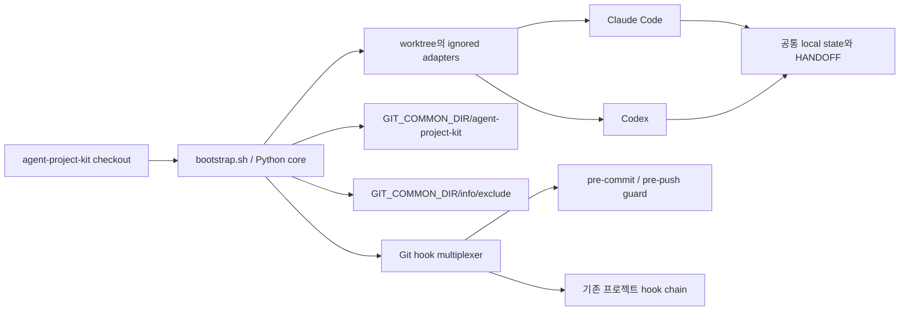
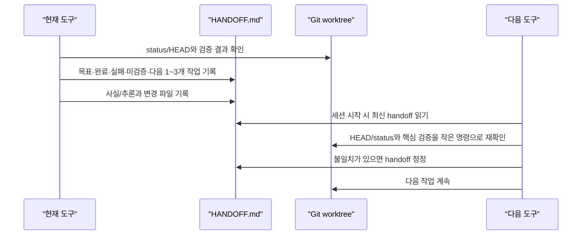

# agent-project-kit 아키텍처와 보안 계약

## 1. 목표

`agent-project-kit`은 Git 프로젝트마다 설치하는 로컬 하네스다.

- 신규 프로젝트와 이미 진행 중인 프로젝트를 모두 지원한다.
- Claude Code와 Codex가 같은 규칙, 스킬, handoff를 사용한다.
- 한 도구의 세션이 끝나도 다른 도구가 검증 상태와 다음 행동을 이어받는다.
- 대상 프로젝트의 commit/push tree에는 킷 소유 파일이 들어가지 않는다.
- 대상의 기존 지침, 설정, 훅과 사용자 변경을 보존한다.
- 설치, 재설치, 진단, 제거의 소유권을 manifest로 설명할 수 있다.

글로벌 에이전트 환경 관리, 모델 라우터, 원격 정책 서버, 대상 프로젝트의 문서 체계를 대신
설계하는 것은 범위가 아니다.

## 2. 구조



### 2.1 공통 코어

공통 코어에는 다음만 둔다.

- 짧은 작업 원칙과 컨텍스트 로딩 순서
- `CONTEXT.md`, `HANDOFF.md`
- 초기화, 편입, handoff, wrap-up, skill-sync 스킬
- `AGENTS.md`(canonical)·`CLAUDE.md`(포인터) 생성·병합용 템플릿
- staged/outgoing commit 및 시크릿 검사
- 파괴적 shell 명령 탐지

provider 이름이 필요한 파일 경로와 hook event 형식은 어댑터에서만 처리한다.

### 2.2 도구 어댑터

| 기능 | Claude Code | Codex | 공통성 |
|---|---|---|---|
| 프로젝트 지침 | `CLAUDE.local.md` | `AGENTS.override.md`가 기존 `AGENTS.md`를 명시적으로 추가 로드 | 공통 core/handoff를 가리킴 |
| 스킬 발견 | `.claude/skills/<name>/SKILL.md` | `.agents/skills/<name>/SKILL.md` | 동일 payload에서 생성 |
| 프로젝트 훅 | `.claude/settings.local.json` | `.codex/hooks.json` | 동일 Python guard 호출 |
| 세션 상태 | `.agent-project-kit/CONTEXT.md`, `HANDOFF.md` | 같은 경로 | 단일 원본 |

Codex의 `AGENTS.override.md`는 같은 디렉터리의 `AGENTS.md`를 대체한다. 설치하는 얇은
어댑터는 이 사실을 숨기지 않고 기존 `AGENTS.md`가 있으면 먼저 도구로 읽고 함께 준수하도록
명시한다. 기존 override가 있으면 덮어쓰지 않고 설치 전에 실패한다.

## 3. 설치 계약

### 3.1 사전 조건

- 대상은 `git rev-parse --is-inside-work-tree`가 성공하는 worktree여야 한다.
- Git root를 명시적으로 대상으로 삼는다. nested repository를 부모 프로젝트로 오인하지 않는다.
- 모든 owned path의 기존 tracked 상태와 symlink 구성 요소를 쓰기 전에 검사한다.
- 도구별 설정 파일이 이미 존재하면 자동 병합하거나 덮어쓰지 않는다. 어느 파일이 충돌했는지
  보고하고 대상 변경 전에 중단한다.

신규 프로젝트도 먼저 `git init`을 실행해야 한다. Git이 없으면 이 킷의 핵심 약속인 commit
격리를 검증할 수 없기 때문이다.

### 3.2 설치 후 불변식

설치 성공은 단순히 파일이 생긴 상태가 아니다. 다음을 모두 만족해야 한다.

1. 설치 전 사용자 `git status --porcelain=v1 -z`가 설치 후에도 동일하다.
2. 대상의 기존 tracked blob hash가 변하지 않는다.
3. 모든 worktree 어댑터가 exact local exclude에 의해 ignore된다.
4. manifest의 파일 hash가 실제 파일과 일치한다.
5. `git add -A` 후 킷 소유 경로는 staged 목록에 0개다.
6. Git pre-commit/pre-push guard가 유효하고 기존 훅 체인도 유지된다.
7. Claude/Codex skill payload가 동일하다.

`--adopt`는 기존 프로젝트라는 사용 의도를 기록하고 초기 handoff에 Git 현황을 더 자세히
남기지만, 격리와 무손상 계약은 기본 설치와 같다.

## 4. 소유권과 저장 위치

### 4.1 worktree

AI 도구가 공식 탐색 경로에서 찾아야 하는 최소 파일만 둔다. 각 경로는 manifest에 개별적으로
기록하고 root-anchored exclude를 사용한다. `.claude/`, `.codex/`, `.agents/` 전체를 ignore하지
않는다. 기존 프로젝트가 추적하는 해당 디렉터리의 정상 파일까지 숨길 수 있기 때문이다.

상태 디렉터리는 다음 의미를 가진다.

```text
.agent-project-kit/
  CONTEXT.md              # 짧은 공통 작업 계약과 비교적 안정적인 프로젝트 사실
  HANDOFF.md              # 현재 목표와 다음 행동
  hooks/guard.py          # Claude/Codex가 공유하는 runtime guard
  templates/              # init/adopt가 쓰는 AGENTS.md·CLAUDE.md 템플릿 (local-only)
```

대상 프로젝트가 추적하는 `docs/`, `AGENTS.md`, `CLAUDE.md`, `.gitignore`에는 킷 상태를 쓰지
않는다. installer는 이 파일들을 절대 생성·수정하지 않는다. 공유 지침 문서의 생성·병합은
`agent-kit-init`/`agent-kit-adopt` 스킬이 사용자 인터뷰와 명시적 승인 하에 수행하는 사용자
작업이며, 그 산출물(`AGENTS.md`, `CLAUDE.md`)은 사용자 소유 tracked 문서로 commit이
허용된다. 킷 guard는 킷 소유 경로만 차단하므로 이 두 파일의 commit을 막지 않는다.

### 4.2 Git common dir

linked worktree에서도 공유해야 하는 설치 원장과 Git guard는 `$GIT_COMMON_DIR/agent-project-kit/`
아래에 둔다.

manifest의 `schema_version`은 배포 payload 구성이 바뀔 때마다 올린다. 과거 schema의
allowlist(스킬·템플릿 목록, exclude line)는 코드에 동결되어 있어, 구버전 설치본은 기록된
schema로 검증한 뒤 재설치로 업그레이드(managed exclude block만 교체)하거나 그대로 제거할
수 있다.

```text
agent-project-kit/
  manifest.json           # schema/version/mode/owned path/hash/hook 원상복구 정보
  guard.py                # Git staged/outgoing commit guard
  dispatcher.py           # 기존 훅과 킷 훅을 합성
  hooks/pre-commit
  hooks/pre-push
agent-project-kit.lock       # common-dir lifecycle 직렬화; 제거 후에도 재사용
```

manifest가 없거나 깨졌을 때 경로를 추측해 삭제하지 않는다. doctor가 실패하고 수동 복구 방법을
안내한다.

## 5. Claude ↔ Codex 전환



handoff의 최소 스키마:

```markdown
# Handoff
- Updated: ISO-8601 timestamp / tool
- Objective: 현재 목표와 acceptance criteria
- Git: branch, HEAD, staged/unstaged/untracked 요약
- Completed: 완료 사실
- Decisions: 결정과 근거
- Verification: 명령 + PASS/FAIL/UNRUN
- Blockers: 실패·미확인·주의사항
- Next: 우선순위 1~3개와 첫 명령
```

전환하는 도구는 handoff를 무조건 진실로 가정하지 않는다. HEAD와 dirty 상태, 중요한 실패를
작은 명령으로 재확인한다. 반대로 전체 저장소를 매번 다시 읽지 않아 토큰과 세션 시간을 아낀다.

## 6. 스킬과 규칙

기본 스킬은 이름과 의미를 provider 중립으로 유지한다.

| 스킬 | 역할 | 주요 산출물 |
|---|---|---|
| `agent-kit-init` | 사용자 인터뷰로 공유 지침 생성 + 신규 프로젝트 로컬 상태 구체화 | 승인된 `AGENTS.md`+포인터 `CLAUDE.md`, `CONTEXT.md`, 첫 `HANDOFF.md` |
| `agent-kit-adopt` | 진행 중인 프로젝트의 현재 상태를 무손상 편입, 승인 하에 지침 병합 개편 | 병합 개편안(diff), 기존 규칙 맵, 검증 기준, 다음 작업 |
| `agent-kit-handoff` | Claude↔Codex 또는 새 세션으로 작업 전달 | 최신 `HANDOFF.md` |
| `agent-kit-wrap-up` | 마일스톤/세션을 정리하고 미완료만 활성 상태에 유지 | 최신 handoff |
| `agent-kit-skill-sync` | 사용자 스킬을 선언된 모든 Agent 도구 경로에 동기화 | 도구별 동일 원본 스킬, 검증 보고 |

스킬 우선순위는 provider마다 다르다. Claude Code는 같은 이름에서 enterprise → personal →
project 순이고, 이 세 범위의 스킬은 bundled skill을 대체한다. Codex는 같은 `name`을 병합하지
않고 둘 다 selector에 노출한다. 따라서 project-local이 global을 공통 방식으로 override한다고
가정하지 않는다. 기본 이름은 `agent-kit-*` namespace를 사용한다. 의도적인 대체가 필요하면
도구별 공식 우선순위와 disable 기능을 확인하고, 고유 이름의 local skill을 명시 호출하며
`CONTEXT.md`에 이유와 검증을 기록한다.

## 7. Git 격리와 훅 공존

### 7.1 방어 계층

| 계층 | 막는 경로 | 한계 |
|---|---|---|
| `info/exclude` | 일반 status와 `git add -A` | 이미 tracked, `git add -f` |
| pre-commit | force-add된 owned path와 staged secret | `--no-verify`, hook 설정 변경 |
| pre-push | guard를 우회해 만들어진 outgoing commit | `--no-verify`, 원격 외 전송 |
| doctor | manifest/hash/exclude/hook/tracked drift | 실행하지 않으면 알림 없음 |
| 원격 CI/정책 | 중앙 강제 | 이 로컬 킷 범위 밖 |

pre-push는 stdin의 ref update를 기준으로 실제 전송 범위를 계산해야 한다. 새 branch, 삭제,
upstream이 없는 경우를 구분하고 파일명 처리는 가능한 범위에서 NUL delimiter를 사용한다.

### 7.2 기존 훅

설치기는 기존 `core.hooksPath`의 유효 경로와 local/worktree scope 값을 manifest에 기록한다.
`extensions.worktreeConfig`가 켜져 있으면 더 높은 우선순위의 worktree scope에 dispatcher를
설정한다. 선택한 Git config의 EOF에 managed block을 append하고 `<config>.lock` O_EXCL을
획득한 상태에서 원본 bytes·mode CAS 후 rename한다. 제거는 설치 hash가 같은 config에서 원래
prefix를 복원한다. config 파일 자체의 후속 변경은 덮어쓰지 않고 중단한다.

dispatcher는 호출 시 현재 branch/`includeIf`를 반영한 `core.hooksPath` 목록에서 managed 값 바로
앞 경로를 동적으로 찾아 원래 인자와 stdin으로 먼저 실행한 뒤 킷 guard를 실행한다. 기존 hook이
index를 바꿔도 마지막 검사를 우회하지 않으며, branch 전환으로 원래 hook이 A에서 B로 바뀌면
B를 호출한다. 제거 후에는 원본 config bytes가 복원되므로 현재 branch의 원래 의미가 드러난다.

`info/exclude`는 UTF-8 텍스트로 재작성하지 않는다. 설치 전 raw bytes와 mode의 hash·경계를
원장에 기록하고 managed block만 append한다. 재설치·제거 전에 전체 bytes/mode와 정확한 block을
검사하며, 깨끗한 제거에서 원래 bytes와 mode를 복원한다. 설치 후 사용자가 이 파일을 바꿨다면
전체 제거를 중단해 어느 줄도 추측해서 삭제하지 않는다.

## 8. 충돌·복구 정책

- **tracked adapter path**: 설치 전 실패. 기존 파일을 ignore하거나 바꾸지 않는다.
- **untracked user file**: 자동 소유권을 주장하지 않고 설치 전 실패한다.
- **symlink parent/leaf**: target 밖 쓰기 가능성이 있으므로 설치 전 실패한다.
- **부분 설치**: 임시 파일에서 완성 후 rename하고, 실패 시 이번 실행에서 만든 소유 파일과
  managed exclude, Git config를 롤백한다. 부모 디렉터리는 파일 allowlist 소유권 밖이므로
  삭제하지 않으며 빈 디렉터리가 남을 수 있다. rollback 자체가 실패하면 수동 감사 경로를 명시한다.
- **사용자 수정 immutable owned file**: doctor는 drift를 보고하고 reinstall을 중단한다.
  uninstall도 전체 작업을 원자적으로 중단하며 강제 덮어쓰기 옵션을 암묵적으로 제공하지 않는다.
- **갱신된 mutable state**: doctor와 reinstall에서는 정상 상태로 취급·보존한다. uninstall은
  데이터 손실을 피하려고 전체 작업을 중단하고 사용자가 별도 보존/폐기를 결정하게 한다.
- **`git clean -fdx`로 adapter 삭제**: Git common dir의 manifest/runtime은 남는다. doctor가
  누락을 잡고 안전한 재설치를 안내한다.
- **branch 전환 후 tracked 충돌**: doctor 실패. 해당 branch에서 adapter를 재생성하지 않는다.
- **tool trust/policy로 hook 비활성**: 도구 훅은 degraded로 보고하되 Git guard는 독립 유지한다.
- **manifest 손상**: 자동 제거 금지. 파일과 Git config를 수동 감사한다.
- **동시 lifecycle 명령**: Git common dir의 persistent lock으로 install/adopt/uninstall을
  직렬화한다. doctor/diff는 기존 lock을 shared로 읽으며 새 파일을 만들지 않는다.
- **여러 linked worktree 동시 설치**: 현재 manifest/hook 원장은 Git common dir당 하나다.
  linked worktree를 대상 삼는 것은 지원하지만 다른 worktree에 이미 설치되어 있으면 먼저
  기존 설치를 제거하도록 실패한다. 공통 `info/exclude`가 sibling의 동명 사용자 파일을 숨길
  수 있으므로 모든 live worktree의 exact/reserved path와 status를 전후 검사한다. 접근 불가
  worktree나 충돌이 있으면 설치·제거 전에 중단한다.
- **lifecycle 중 worktree 추가/제거**: 성공 직전 worktree/bare inventory를 다시 읽어 최초 목록과
  비교하고, sibling collision·effective hook·status를 재검증한다. 하나라도 바뀌면 rollback한다.
- **bare + linked local hook**: 서버 hook까지 같은 local config를 공유하므로 거부한다.
  `extensions.worktreeConfig=true`인 worktree-scope 설치만 허용한다.

## 9. 토큰·세션·모델 효율

- startup에는 `CONTEXT.md`와 최신 handoff의 고신호 요약만 넣는다.
- 상세 절차와 긴 체크리스트는 관련 스킬이 호출될 때만 읽는다.
- handoff에는 전체 로그가 아니라 정확한 명령, 최종 결과, 실패 원인을 남긴다.
- 완료 이력은 근거만 짧게 압축하고 활성 handoff에는 다음 행동을 우선한다.
- 탐색과 독립 검사는 병렬화하되 동일 파일을 여러 에이전트가 중복 조사하지 않는다.
- 기계적 작업과 명확한 분류에는 저비용 모델을, 설계 판단과 복합 디버깅에는 강한 모델을 쓴다.
- 실패가 측정되지 않은 상태에서 planner/evaluator 계층을 관성적으로 추가하지 않는다.
- “가장 큰 모델”보다 테스트·관측·작은 피드백 루프를 우선한다.

## 10. 검증 범위와 한계

자동 테스트가 검증해야 하는 최소 축:

- 신규/기존/공백 경로/linked worktree 설치
- 사용자 status 및 tracked blob 불변
- 일반 add, force-add, commit, push 격리
- 기존 hook chain과 uninstall 복원
- symlink escape와 tracked/untracked 충돌
- manifest/hash/exclude 변조 doctor 감지
- 조작된 manifest path traversal·symlink parent와 common-dir 동시 실행 차단
- local/worktree `core.hooksPath` 우선순위와 기존 hook 복원
- Git config include 순서·lock 경쟁·branch별 동적 hook chain
- Claude/Codex skill parity와 공통 handoff
- 파괴 명령·시크릿 guard 회귀

실제 Claude Code와 Codex의 프로젝트 trust 승인 UI, 조직 managed policy, 모든 운영체제의 파일
권한은 로컬 unit/integration test만으로 완전히 검증할 수 없다. 릴리스 노트에는 PASS뿐 아니라
이 미검증 축도 함께 기록한다.

설치 원장은 worktree 절대 경로를 사용한다. 디렉터리 이동 전 uninstall하고 이동 후 재설치해야
한다. 또한 local-only 파일은 Git clone이나 원격 agent 환경으로 전파되지 않으므로 checkout마다
별도 설치가 필요하다. Windows와 네트워크 파일시스템의 lock/권한 동작은 현재 지원·검증 범위가
아니다.
